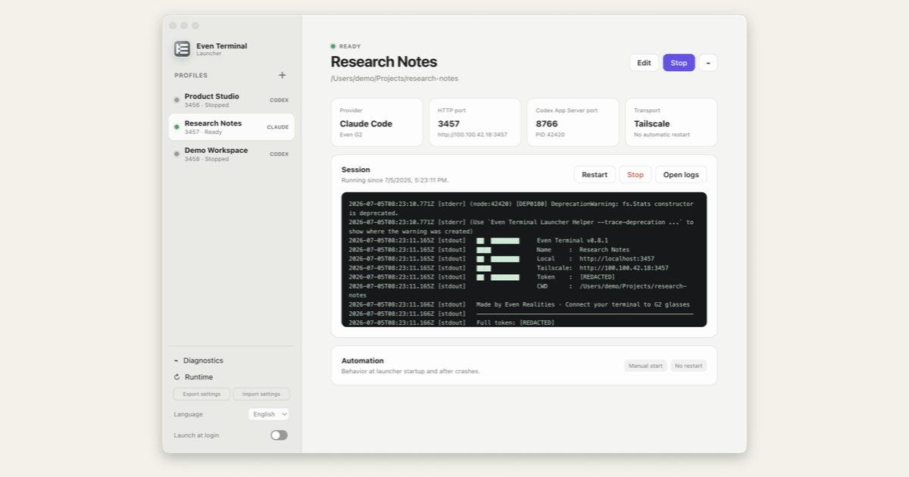

# Even Terminal Launcher

[日本語](./README.ja.md)



_Illustrative mockup. The profiles, paths, addresses, ports, and log values are
fictional._

An unofficial desktop launcher for managing
[`@evenrealities/even-terminal`](https://www.npmjs.com/package/@evenrealities/even-terminal)
connection profiles from the macOS menu bar or Windows system tray.

This launcher was created and is maintained independently by 3mintimer. It is
not an official Even Realities product and is not endorsed by or affiliated
with Even Realities.

## Project maintenance

This is a personal project maintained for the author's own use. Pull requests,
feature requests, and general support are not currently accepted. You are
welcome to fork the MIT-licensed code and maintain your own version.

Brand assets are excluded from the MIT License and must be replaced or handled
separately. Security reports are handled separately under the
[security policy](./SECURITY.md).

## Project status

- **macOS Apple Silicon:** locally verified.
- **Windows:** implementation, CI, and unsigned packaging are prepared, but the
  application has not been accepted on a Windows machine.
- **Public releases:** not available yet. Current macOS packages use ad-hoc
  signing and are intended for local testing.
- **Linux:** outside the current project scope.

See [Windows readiness](./docs/platform/windows-readiness.md) for the exact
verification boundary.

## Features

- Run multiple Even Terminal profiles from a menu bar or tray application.
- Configure Claude Code or Codex, working directory, HTTP port, and Codex
  app-server port per profile.
- Detect port conflicts and supervise start, health check, restart, and stop.
- Store bridge tokens with Electron `safeStorage` and pass them to child
  processes through `BRIDGE_TOKEN`, never command-line arguments.
- Connect over LAN, Tailscale-advertised addresses, selected interfaces, or
  supported tunnel helpers.
- Redact tokens from profile logs and diagnostics.
- Check, install, activate, and roll back isolated Even Terminal runtimes.
- Export and import portable profile configuration without tokens or executable
  overrides.
- Use Japanese, English, Simplified Chinese, Traditional Chinese, Korean, or
  Spanish UI.

## Requirements

- Node.js 24.18.0 (pinned in [`mise.toml`](./mise.toml))
- npm
- An installed and authenticated `claude` or `codex` command
- For device use: Even Realities G2 and the Even app

The application embeds Even Terminal 0.8.1 as its initial runtime.

## Run from source

```bash
git clone <repository-url>
cd even-hub-launcher
mise install
mise exec -- npm ci
mise exec -- npm run dev
```

If you do not use `mise`, install Node.js 24.18.0 and run the npm commands
directly.

## Basic use

1. Start the launcher. On macOS it remains in the menu bar.
2. Open the launcher window and create a profile.
3. Choose Claude Code or Codex and select the profile's working directory.
4. Keep the suggested HTTP and Codex app-server ports, or choose two unused
   ports. Every profile must have a unique pair.
5. Select a connection transport and start the profile.
6. Open the connection details, then use the URL/QR information in the Even app.
7. Stop the profile from the launcher when finished.

Tokens are stored locally and are intentionally omitted from configuration
exports.

## Development and verification

```bash
npm ci
npm run typecheck
npm run lint
npm test
npm run license:check
npm run build
npm run smoke       # macOS
npm run package
```

`npm run package` creates a local unsigned/ad-hoc-signed host package. It does
not create a notarized macOS release or a signed Windows installer.

## Network security

Even Terminal 0.8.1 listens on `0.0.0.0`, including when `--tailscale` is used.
That option selects the advertised Tailscale address; it does not restrict the
server to the Tailscale interface. Treat connection URLs and bridge tokens as
credentials, and use a trusted network path.

## Licensing and brand assets

The launcher code and documentation created by 3mintimer are available under
the [MIT License](./LICENSE), except where explicitly noted.

The icons and preview image were prepared for this project, but they incorporate
an Even Realities brand mark. 3mintimer does not claim ownership of that mark,
so these image files are **not** offered under the MIT License. See
[Brand asset notice](./BRAND_ASSETS.md) and [NOTICE.md](./NOTICE.md).

Even Terminal, the Claude Agent SDK, and other dependencies remain under their
respective terms. The current audit is documented in
[Third-party notices](./THIRD_PARTY_NOTICES.md) and the generated
[dependency license inventory](./docs/legal/dependency-license-inventory.md).
Confirm the unresolved Even Terminal redistribution terms and permission for
the brand assets before distributing packaged builds.

## Documentation

- [Current handoff](./docs/HANDOFF.md)
- [Architecture](./docs/architecture.md)
- [Even Terminal 0.8.1 snapshot](./docs/upstream/even-terminal-0.8.1-snapshot.md)
- [Windows readiness](./docs/platform/windows-readiness.md)
- [Verification records](./docs/verification/README.md)
- [Release-readiness checklist](./docs/releasing.md)
- [Security policy](./SECURITY.md)
